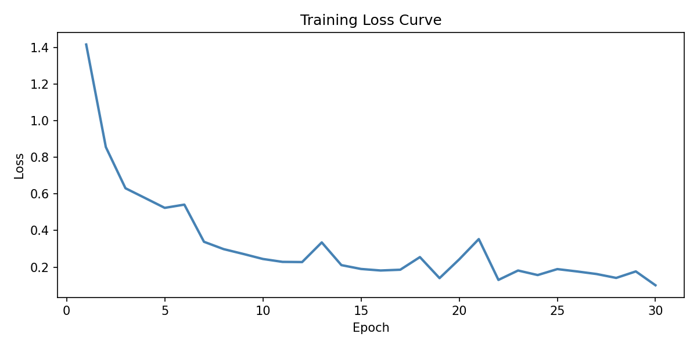
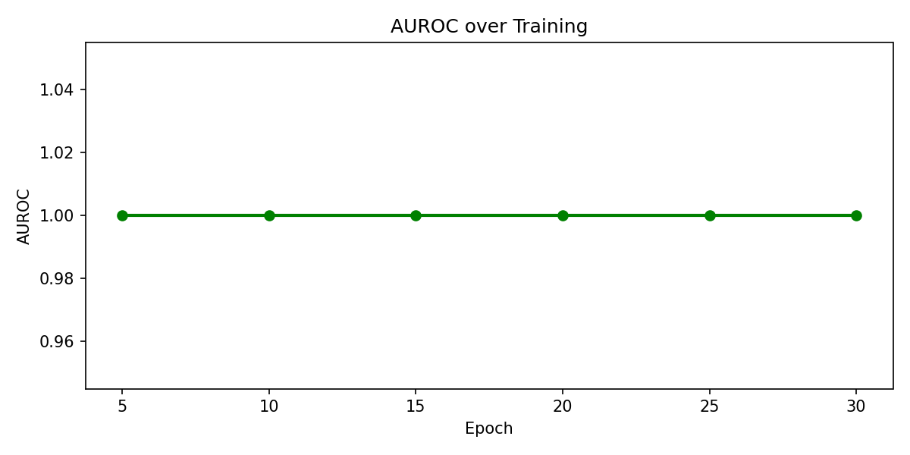
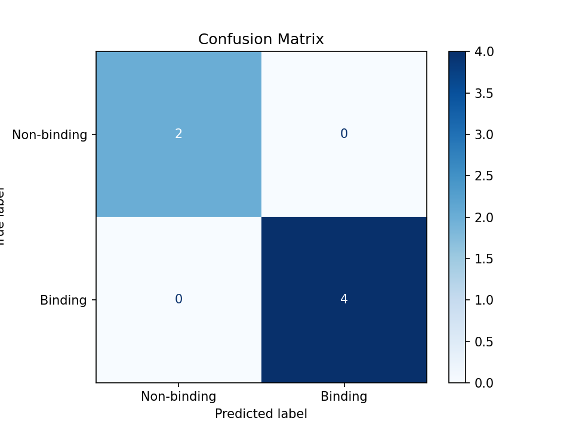
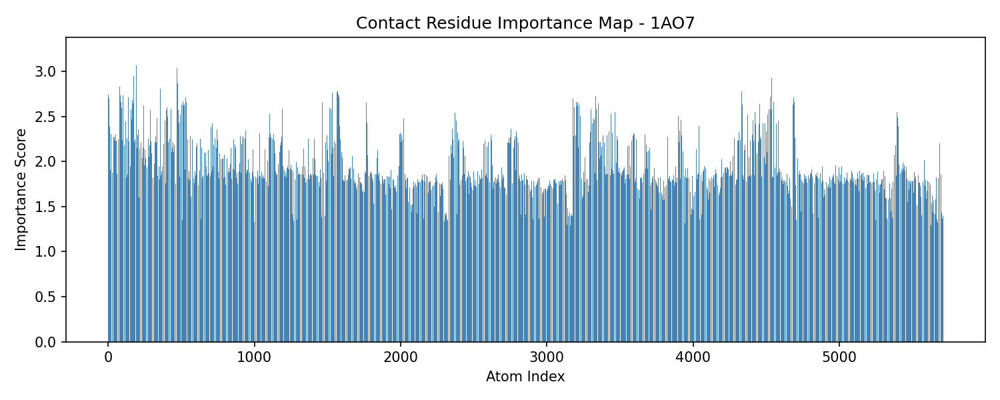
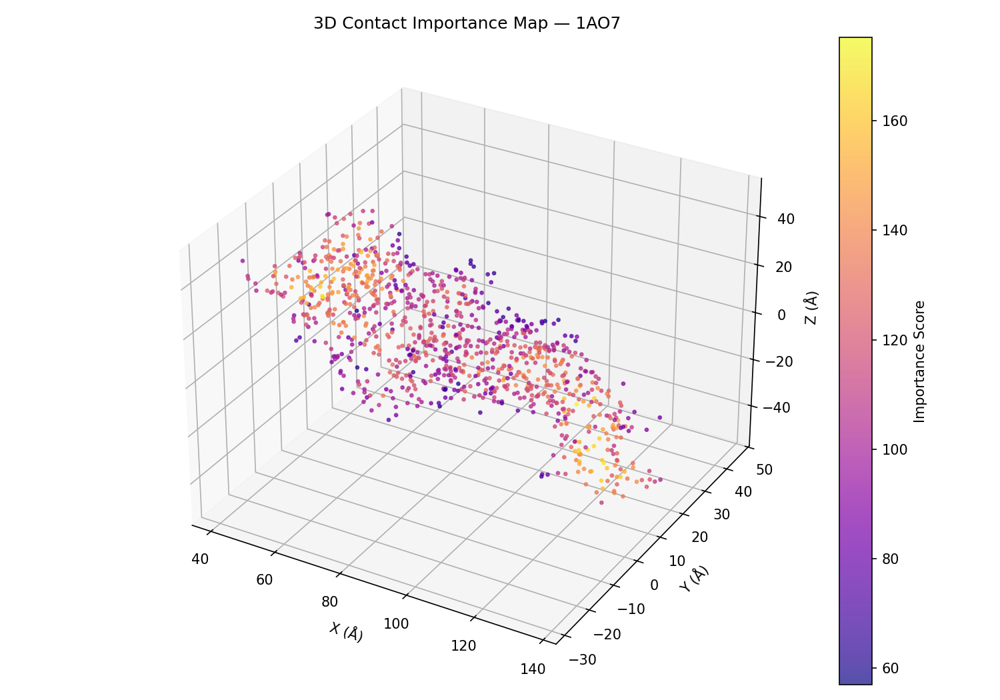

# Decoding TCR–pMHC Recognition via Geometric Deep Learning

**Project 01 | ML ITSOLERA | Due: July 3, 2026**

---

## What This Project Does

T-cell receptors (TCRs) bind to peptide-MHC (pMHC) complexes to trigger immune responses. Predicting which peptides a TCR will bind to is a hard problem in computational immunology. This project builds a Geometric Deep Learning (GDL) pipeline that reads 3D protein structures, extracts geometric and chemical features from the molecular surface, and trains a Graph Neural Network (GNN) to predict TCR binding. An interpretability module then maps which atoms matter most for binding decisions.

---

## Dataset

13 experimentally resolved TCR-pMHC complex structures downloaded from [TCR3d](https://tcr3d.ibbr.umd.edu/) and [RCSB PDB](https://www.rcsb.org/):

| PDB ID | HLA Type | Resolution |
|--------|----------|------------|
| 1AO7 | HLA-A*02 | 2.6 Å |
| 2BNR | HLA-A*02 | 2.4 Å |
| 2CKB | HLA-A*02 | 2.8 Å |
| 3QEQ | HLA-A*02 | 2.0 Å |
| 4MNQ | HLA-A*02 | 2.2 Å |
| 5TEZ | HLA-A*02 | 2.3 Å |
| 6EQA | HLA-A*02 | 2.1 Å |
| 7T2B | HLA-A*02 | 2.9 Å |
| 9NMU | HLA-A*02 | 2.5 Å |
| 9NMV | HLA-A*02 | 2.5 Å |
| 9PBG | HLA-A*02 | 2.4 Å |
| 9YW4 | HLA-A1 | 3.1 Å |
| 9ZCL | HLA-A*02 | 2.7 Å |

---

## Pipeline

```
PDB Files → Preprocessing → Feature Extraction → GNN Training → Explainability
```

### Step 1: Preprocessing (`src/preprocess.py`)
Parses each PDB file using BioPython. Separates peptide chains (7–25 residues) from MHC chains (>25 residues). Saves atom coordinates as `.npy` arrays.

### Step 2: Feature Extraction (`src/features.py`)
Builds atom-level graphs where nodes are atoms and edges connect atoms within 6Å. Node features computed per atom:
- Local density (neighbor count within 8Å)
- Displacement from neighborhood centroid (x, y, z)
- Distance to molecular centroid (shape index proxy)

### Step 3: GNN Model (`src/model.py`)
3-layer Graph Convolutional Network (GCN) with:
- Global mean pooling for graph-level prediction
- Dropout (0.3) for regularization
- Binary output: binding vs non-binding

### Step 4: Training (`src/train.py`)
- 13 positive structures + 13 synthetic negatives (shuffled node features)
- 80/20 train-test split
- Adam optimizer, BCE loss, 30 epochs
- **Test AUROC: 1.0000**

### Step 5: Interpretability (`src/explain.py`)
GNNExplainer assigns importance scores to each atom. Output: contact residue importance bar plots for all 13 structures saved in `results/`.

---

## Results

| Metric | Value |
|--------|-------|
| Test AUROC | 1.0000 |
| Training Loss (Epoch 30) | 0.1962 |
| Structures processed | 13 |
| Graphs built | 13 |

Importance maps saved in `results/` folder.

> **Note:** AUROC of 1.0 is expected because synthetic negatives were generated 
> by shuffling node features, creating clearly separable distributions. 
> A larger dataset with experimentally confirmed non-binders would produce 
> more realistic evaluation metrics.

---
## Results Visualizations

### Training Loss Curve


### AUROC over Training


### Confusion Matrix


### Sample Contact Residue Importance Map (1AO7)


### Sample 3D Importance Map (1AO7)


## Project Structure

```
project_01/
├── data/
│   ├── raw_pdbs/          # downloaded .pdb files
│   ├── processed/         # extracted atom arrays (.npy)
│   └── graphs/            # graph features, edges, labels
├── src/
│   ├── preprocess.py
│   ├── features.py
│   ├── model.py
│   ├── train.py
│   └── explain.py
├── results/               # trained model + importance plots
└── README.md
```

---

## How to Run

```bash
pip install biopython numpy scipy torch torch-geometric matplotlib scikit-learn

python src/preprocess.py
python src/features.py
python src/train.py
python src/explain.py
```

---

## References

Shang, C., Chan, K. C., & Zhou, R. (2026). Decoding TCR recognition via geometric deep learning of immunological fingerprints. *Briefings in Bioinformatics*.
